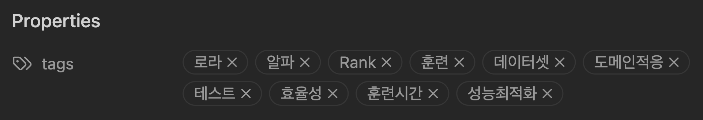
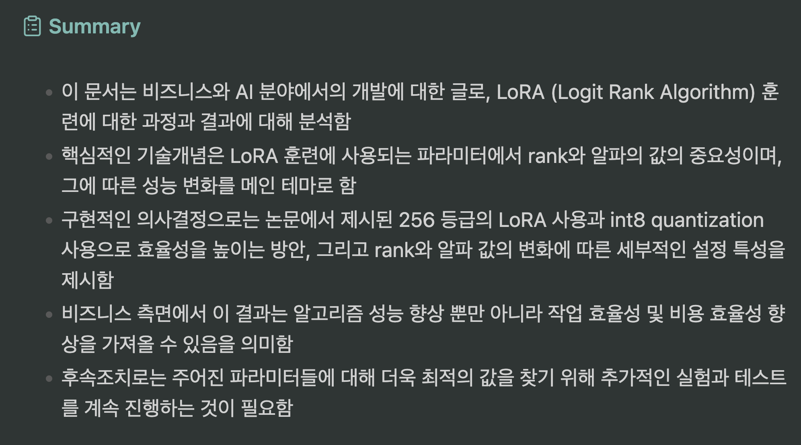
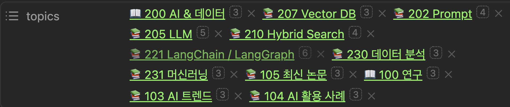

# Obsidian Templater

본 Template 은 구요한 교수님의 Obsidian AI 활용 원데이 세미나와 [안피곤의 성장블로그](https://anpigon.tistory.com/484)의 내용을 참고하여 만들었습니다.

좋은 인사이트를 주신 두 분께 감사드립니다.

**참고 자료**

- [커맨드스페이스 월간 옵시디언 1회차 - 옵시디언의 AI 활용](https://youtu.be/GXVh4JI2xd8?si=4649TyzEmEkoraCj)
- [안피곤의 성장블로그](https://anpigon.tistory.com/484)

**데모 영상**

**Obsidian + Dify 연동하여 RAG / Agent / Workflow 사용하기**

**Obsidian Templater 를 활용한 메타데이터, 제목, 요약 자동화**

## 준비사항

- [Obsidian](https://obsidian.md/download)
- [Templater](https://github.com/SilentVoid13/Templater)
- [OpenAI API Key](https://platform.openai.com/settings/organization/api-keys)

## Template 소개

1. [BasicSetup](./templates/Template-01-BasicSetup.md): 기본 Obsidian 상단 property 설정(created, author, source, notetype, etc.)
2. [Title](./templates/Template-02-Title.md): 제목을 GPT 가 자동으로 생성
3. [Topic](./templates/Template-03-Topic.md): 주제 리스트를 GPT 가 자동으로 생성. 생성된 주제는 Obsidian Topics 노트와 연결
4. [Index](./templates/Template-04-Index.md): 목차 리스트를 GPT 가 자동으로 생성. 생성된 목차는 Obsidian Index 노트와 연결
5. [Tag](./templates/Template-05-Tag.md): 본문의 내용을 참고하여 태그 리스트를 GPT 가 자동으로 생성. 1~10개
6. [Summary](./templates/Template-06-Summary.md): 본문의 내용을 참고하여 요약 문장을 GPT 가 자동으로 생성. Bullet 형식으로 생성
7. [Custom Prompt](./templates/Template-07-Custom-Prompt.md): 사용자가 직접 프롬프트를 입력하여 사용
8. [Dify](./templates/Template-10-Dify-Chat-Simple.md): Dify 챗봇 연동
9. [Dify](./templates/Template-11-Dify-Chat-Custom-Prompt.md): Dify 챗봇 연동(커스텀 프롬프트)
10. [Dify](./templates/Template-12-Dify-Chat-With-Inputs.md): Dify 챗봇 연동(입력 변수 사용)
11. [Dify](./templates/Template-13-Dify-Agent.md): Dify 에이전트 연동
12. [Dify](./templates/Template-14-Dify-Agent-News.md): Dify 뉴스 에이전트 연동
13. [Dify](./templates/Template-15-Dify-WorkFlow.md): Dify RAG 워크플로우 연동
14. [Dify](./templates/Template-16-Dify-WorkFlow-Web-Research.md): Dify RAG 워크플로우 연동(웹 리서치 보고서 작성)

## 예시

## Templater 설치 및 활용 강의(YouTube)

## License

MIT License

Copyright (c) 2025 테디노트

Permission is hereby granted, free of charge, to any person obtaining a copy
of this software and associated documentation files (the "Software"), to deal
in the Software without restriction, including without limitation the rights
to use, copy, modify, merge, publish, distribute, sublicense, and/or sell
copies of the Software, and to permit persons to whom the Software is
furnished to do so, subject to the following conditions:

The above copyright notice and this permission notice shall be included in all
copies or substantial portions of the Software.

THE SOFTWARE IS PROVIDED "AS IS", WITHOUT WARRANTY OF ANY KIND, EXPRESS OR
IMPLIED, INCLUDING BUT NOT LIMITED TO THE WARRANTIES OF MERCHANTABILITY,
FITNESS FOR A PARTICULAR PURPOSE AND NONINFRINGEMENT. IN NO EVENT SHALL THE
AUTHORS OR COPYRIGHT HOLDERS BE LIABLE FOR ANY CLAIM, DAMAGES OR OTHER
LIABILITY, WHETHER IN AN ACTION OF CONTRACT, TORT OR OTHERWISE, ARISING FROM,
OUT OF OR IN CONNECTION WITH THE SOFTWARE OR THE USE OR OTHER DEALINGS IN THE
SOFTWARE.
